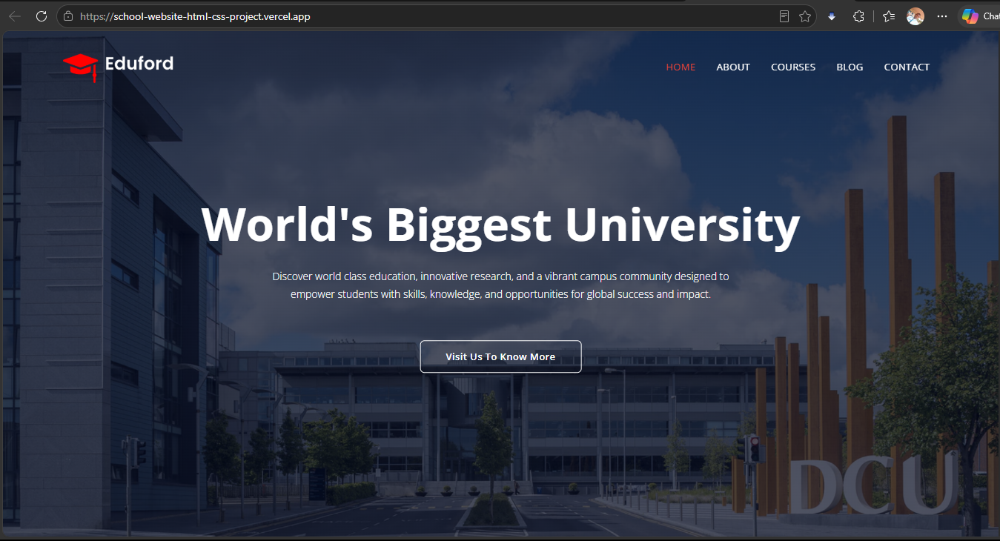

# 🎓 Eduford — Fully Responsive University Website

A clean, modern, multi-page university website built with **HTML5, CSS3, vanilla JavaScript**, and a lightweight **PHP** contact handler. The project focuses on solid front-end fundamentals — semantic structure, a consistent design system, responsive layouts, and small accessibility and UX touches — without any frameworks or build tooling.

**🔗 Live Demo:** [school-website-html-css-project.vercel.app](https://school-website-html-css-project.vercel.app/)
**📦 Repository:** [Fully-Responsive-School-Website-HTML-CSS-Project](https://github.com/miirosadat-dev/Fully-Responsive-School-Website-HTML-CSS-Project)




---

## Table of Contents

- [Features](#-features)
- [Project Structure](#️-project-structure)
- [Tech Stack](#-tech-stack)
- [Getting Started](#-getting-started)
- [Pages](#-pages)
- [A Note on the Contact Form](#️-a-note-on-the-contact-form)
- [Roadmap](#-roadmap)
- [Author](#-author)
- [License](#-license)

---

## ✨ Features

- **Fully responsive layout** across five pages (Home, About, Courses, Blog, Contact), from mobile through desktop
- **Accessible mobile navigation** — animated slide-in menu with a backdrop overlay, keyboard support (Enter/Space to open, Escape to close), and proper `aria-label`/`aria-expanded` attributes
- **Consistent design system** driven by CSS custom properties for color, spacing, radius, and shadow — easy to re-theme from one place
- **Reusable UI components** — buttons, course/facility/testimonial cards, pill-style blog category tags, and a multi-column footer
- **Scroll-reveal animations** on cards and sections, with a `prefers-reduced-motion` fallback for accessibility
- **Client-side form validation** with inline error messages on the contact form and blog comment form
- **Working contact form** backed by a simple PHP mail handler, with a success/error confirmation banner after submission
- **Newsletter signup** on the homepage call-to-action section
- **Active nav-link highlighting** based on the current page
- **SEO basics** — unique meta description and Open Graph tags per page, plus a custom SVG favicon (no external image dependency)

---

## 🗂️ Project Structure

```
.
├── index.html            # Home page
├── about.html             # About Us page
├── course.html            # Courses page
├── blog.html               # Blog / certificates page
├── contact.html           # Contact page
├── form-handler.php       # PHP handler for the contact & newsletter forms
├── favicon.svg            # Site favicon (inline SVG monogram)
├── scripts/
│   └── main.js            # Nav toggle, scroll reveal, form validation, status banner
├── styles/
│   ├── style.css          # Design tokens + shared layout, components, footer
│   ├── about-us.css       # About page & sub-header styling
│   ├── blog.css           # Blog layout, category pills, comment form
│   └── contact.css        # Contact page layout & info card
└── images/                # Logo, campus, facility, and testimonial images
```

---

## 🛠️ Tech Stack

| Layer      | Technology                                   |
|------------|-----------------------------------------------|
| Markup     | HTML5 (semantic `header` / `main` / `footer`)  |
| Styling    | CSS3 — custom properties, Flexbox, media queries |
| Behavior   | Vanilla JavaScript (no frameworks, no build step) |
| Forms      | PHP (`mail()`-based contact/newsletter handler) |
| Icons      | [Font Awesome](https://fontawesome.com/) via CDN |
| Typography | [Open Sans](https://fonts.google.com/specimen/Open+Sans) via Google Fonts |
| Hosting    | [Vercel](https://vercel.com/) (static front end) |

---

## 🚀 Getting Started

### Prerequisites

Just a modern web browser to view the pages. To actually test the contact/newsletter forms locally, you'll also need [PHP](https://www.php.net/) installed.

### Run locally

1. Clone the repository:

   ```bash
   git clone https://github.com/miirosadat-dev/Fully-Responsive-School-Website-HTML-CSS-Project.git
   cd Fully-Responsive-School-Website-HTML-CSS-Project
   ```

2. Open `index.html` directly in your browser to browse the site, **or** serve it with PHP's built-in server so `form-handler.php` also works:

   ```bash
   php -S localhost:8000
   ```

   Then visit `http://localhost:8000` in your browser.

---

## 📄 Pages

| Page              | File            | Description                                                             |
|-------------------|------------------|---------------------------------------------------------------------------|
| **Home**          | `index.html`     | Hero section, course overview, campus locations, facilities, testimonials, and a newsletter sign-up |
| **About**         | `about.html`     | Mission statement and university overview                                 |
| **Courses**       | `course.html`    | Course categories and campus facilities                                   |
| **Blog**          | `blog.html`      | Featured article, post categories, and a comment form                     |
| **Contact**       | `contact.html`   | Embedded map, contact details, and a validated contact form               |

---

## ⚠️ A Note on the Contact Form

`form-handler.php` uses PHP's built-in `mail()` function, which requires a **PHP-enabled server** to actually send email. The live demo is hosted on **Vercel**, which serves static sites and doesn't run PHP by default — so on the deployed version, the form's layout and client-side validation work as shown, but message delivery would need one of the following:

- Hosting the project on a PHP-capable server (e.g., shared hosting, a LAMP/WAMP stack, or a VPS), **or**
- Swapping `form-handler.php` for a serverless function or a third-party form backend (e.g., [Formspree](https://formspree.io/), [Getform](https://getform.io/), or a Vercel serverless function).

---

## 🗺️ Roadmap

Ideas for future iterations:

- [ ] Wire the blog comment form to a real backend/database
- [ ] Self-host Font Awesome instead of relying on a CDN
- [ ] Add a working search/filter for blog categories
- [ ] Add unit/end-to-end tests for the JavaScript form validation

---

## 👤 Author

**Miiro Sadat**

- 🌐 Portfolio: [miirosadat.com](https://miirosadat.com)
- 💼 LinkedIn: [linkedin.com/in/sadat-miiro](https://www.linkedin.com/in/sadat-miiro)
- ✉️ Email: [miirosadat0@gmail.com](mailto:miirosadat0@gmail.com)

---

## 📃 License

This project does not currently include a license file, which means all rights are reserved by default. If you'd like others to freely reuse or build on this code, consider adding an [MIT License](https://choosealicense.com/licenses/mit/) (or another license of your choice) to the repository.
